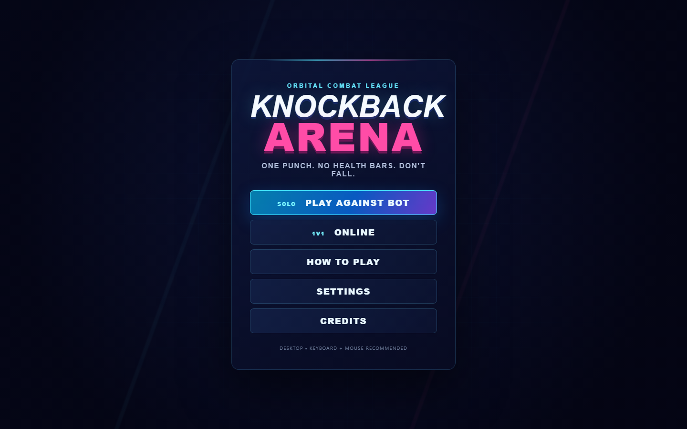
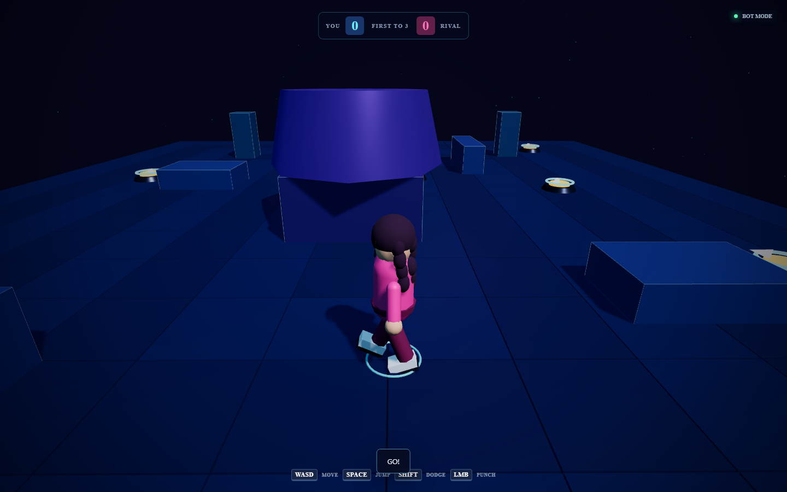
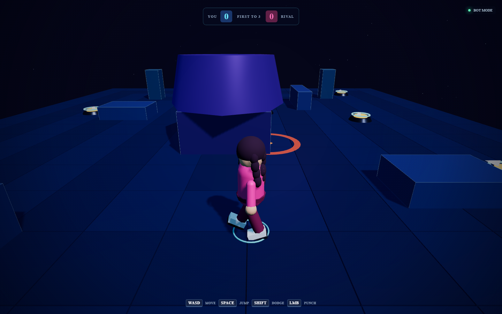
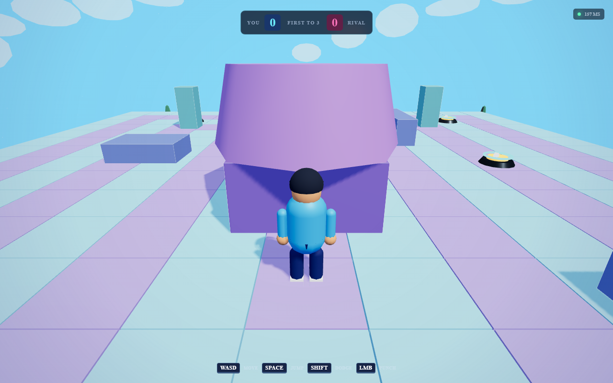
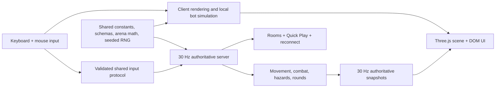

# Knockback Arena

Knockback Arena is a third-person 3D party fighter for the browser. Two stylized pilots sprint, jump, dodge, and use one committed punch to knock each other from a floating mechanical arena. There are no health bars, damage percentages, stamina meters, lock-on controls, or combo trees: positioning wins.

## Screenshots






## Features

- Offline-first single-player with Easy, Normal, and Hard dynamic-grid/steering bot profiles.
- Server-authoritative private room codes and public Quick Play pairing.
- First-to-three rounds, simultaneous ring-out draws, rematches, and a 15-second reconnect window.
- True free-look third-person camera with pointer lock, pitch limits, zoom, collision, and speed FOV.
- Rapier collision, fixed-step simulation, stable floor tiles, climbable obstacles, and CCD fighters.
- A deterministic 19 × 15 arena with falling outer rings and a final central combat space.
- Eight seeded mechanical bouncers with safe far-edge landings and locked launch arcs.
- Seeded meteors with readable warnings and exactly one second of stun—never damage or knockback.
- Original procedural low-poly boy and girl fighters, including intentionally layered curly hair.
- Persistent accessibility, audio, camera, and quality settings.
- Responsive menus with an explicit keyboard-and-mouse recommendation on mobile.

## Controls

| Input         | Action                       |
| ------------- | ---------------------------- |
| W / A / S / D | Camera-relative movement     |
| Mouse         | Free camera look             |
| Mouse wheel   | Camera zoom                  |
| Space         | Jump                         |
| Left mouse    | Punch                        |
| Shift         | Directional dodge            |
| E             | Directional brace            |
| Escape        | Pause / release pointer lock |

The camera never automatically rotates toward the opponent and there is no lock-on key.

Combat readability is color-coded: yellow shows the committed punch lane, blue shows an active
front-facing brace, and a green halo shows that a perfect-dodge counter is ready. Simultaneous
punches clash and recoil instead of applying two full knockbacks.

## Architecture



The repository is an npm-workspace monorepo:

- `apps/client`: Vite, Three.js, Rapier, UI, bot, camera, audio, and networking client.
- `apps/server`: Express health API, Socket.IO rooms, matchmaking, rate limits, and fixed-tick match simulation.
- `packages/shared`: deterministic rules, schemas, protocol types, arena math, and combat queries.

Clients send intent, never successful hits, positions, hazard outcomes, or round results. Online gameplay authority stays on the server. The simulation produces complete snapshots that can later be sent to spectators without changing player authority.

## Local setup

Requirements: Node.js 20 or newer and npm 10 or newer.

```bash
npm install
copy .env.example .env
npm run dev
```

Open [http://localhost:5173](http://localhost:5173). The server listens on [http://localhost:3001/health](http://localhost:3001/health). Bot Mode works without the server.

Individual processes:

```bash
npm run dev:client
npm run dev:server
npm run preview
```

## Environment variables

Copy `.env.example` locally. Client variables use the `VITE_` prefix; server variables are validated at startup. `ALLOWED_ORIGINS` accepts a comma-separated list of exact origins, which is useful for production and preview domains. Never commit `.env` files.

## Playing

For Bot Mode, choose a fighter and difficulty from the main menu. Normal is the intended default. For a private online match, one player creates a room and shares its five-character code; the other joins, and both ready up. Quick Play pairs the oldest two queued clients. A sleeping free multiplayer service can take time to wake, but menus remain responsive and Bot Mode stays available.

## Quality gates

```bash
npm run format:check
npm run lint
npm run typecheck
npm run test
npm run build
npm run test:e2e
npm run audit:production
```

See [TESTING.md](TESTING.md) for the manual cross-browser, network, performance, and ten-rematch checklist.

## Deployment

The Vite client is configured for Vercel and the persistent Socket.IO server is configured for a Render Web Service. See [DEPLOYMENT.md](DEPLOYMENT.md) for the production order, environment values, cold-start behavior, CORS handoff, and two-browser verification.

- Production game: [https://knockback-arena.vercel.app](https://knockback-arena.vercel.app)
- Multiplayer server: [https://knockback-arena-server.onrender.com](https://knockback-arena-server.onrender.com)
- Source: [https://github.com/colelifts/knockback-arena](https://github.com/colelifts/knockback-arena)

## Troubleshooting

- **Multiplayer says it is waking:** wait for the Render cold start, then retry. Bot Mode is unaffected.
- **Pointer lock is denied:** click directly on the 3D arena. Browser policy requires a user gesture.
- **Black or missing scene:** update the browser/GPU driver and ensure WebGL 2 is enabled.
- **Room code rejected:** codes are five characters and omit ambiguous `I`, `O`, `0`, and `1`.
- **Version mismatch:** deploy client and server from the same commit, then hard-refresh.
- **Port already in use:** change `PORT` for the server or stop the previous local process.

## Current limitations

- Desktop keyboard/mouse is the gameplay target; mobile menus work but touch combat is not claimed.
- Online movement is predicted immediately, replays unacknowledged inputs during thresholded reconciliation, and renders remote players from a 65 ms interpolation buffer.
- Spectator-compatible snapshots exist, but there is no public spectator UI.
- Music and effects are repo-local CC0 assets with OGG/MP3 fallback, separate mixer buses, and positional gameplay attenuation. See `docs/audio-selection.md`.
- Append `?debug=1` for live frame, physics, network, prediction, body, draw, triangle, movement, grounded, and action diagnostics.
- Free hosting can sleep and does not guarantee uptime.

## License and assets

Code and original procedural art are MIT licensed. Third-party runtime libraries retain their own licenses. See [ATTRIBUTIONS.md](ATTRIBUTIONS.md) and `apps/client/public/assets/licenses/`.
